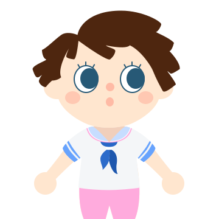

<h1 align="center"> <br />Animal Crossing Avatar Style</h1>
<p align="center">
  <strong>Avatar Style for <a href="https://dicebear.com/">DiceBear Avatars</a>.</strong><br />
    Animal Crossing Avatar Style
    licensed under
      <a href="https://creativecommons.org/licenses/by/4.0/">CC BY 4.0</a>.
</p>

<p align="center">
  While our code is MIT licensed, the design is licensed under
    <a href="https://creativecommons.org/licenses/by/4.0/">CC BY 4.0</a>.
  See <a href="https://dicebear.com/licenses">license overview</a> for more information.
</p>

----

## Usage

Install the DiceBear package and this Avatar styles with the following command.

```
npm install @dicebear/avatars @yareyaredesuyo/dicebear-animal-crossing-style --save
```

Now you are ready to create your first Avatar.

```js
import { createAvatar } from '@dicebear/avatars';
import * as style from '@yareyaredesuyo/dicebear-animal-crossing-style';

let svg = createAvatar(style, {
  seed: 'custom-seed',
  // ... and other options
});
```

## Options

All [options from DiceBear](https://avatars.dicebear.com/docs/options) and additionally the following:

### blush

type: `array`  
allowed: `solidPink`, `softPink`, `solidCoral`, `softCoral`  
default: `['solidPink', 'softPink', 'solidCoral', 'softCoral']`


### hair

type: `array`  
allowed: `smooth`, `upTop`, `bob`, `straightUp`, `diva`, `princess`, `eggshell`, `leafy`, `kindergarten`, `chipper`, `shaggy`, `twinBraids`, `chill`, `fairy`, `noMessBun`, `someMessBun`, `undercut`, `brock`, `dino`  
default: `['smooth', 'upTop', 'bob', 'straightUp', 'diva', 'princess', 'eggshell', 'leafy', 'kindergarten', 'chipper', 'shaggy', 'twinBraids', 'chill', 'fairy', 'noMessBun', 'someMessBun', 'undercut', 'brock', 'dino']`


### eyes

type: `array`  
allowed: `cat`, `kindLash`, `sideEye`, `kind`, `sparkly`, `dreamy`, `sleepy`, `lookAtMeBottomLash`, `lookAtMeTopLash`, `lookAtMe`, `zzz`, `smiling`, `zzzLashes`, `smilingLash`, `circleBottomLash`, `circleTopLash`, `circle`, `ovalBottomLash`, `ovalTopLash`, `oval`  
default: `['cat', 'kindLash', 'sideEye', 'kind', 'sparkly', 'dreamy', 'sleepy', 'lookAtMeBottomLash', 'lookAtMeTopLash', 'lookAtMe', 'zzz', 'smiling', 'zzzLashes', 'smilingLash', 'circleBottomLash', 'circleTopLash', 'circle', 'ovalBottomLash', 'ovalTopLash', 'oval']`


### mouth

type: `array`  
allowed: `smallSmile`, `surprise`, `kissy`, `wideSmile`, `laugh`, `drool`, `catSmile`, `bunnySmile`  
default: `['smallSmile', 'surprise', 'kissy', 'wideSmile', 'laugh', 'drool', 'catSmile', 'bunnySmile']`


### nose

type: `array`  
allowed: `triangle`, `oval`, `rectangle`, `circle`  
default: `['triangle', 'oval', 'rectangle', 'circle']`


### tee

type: `array`  
allowed: `star`, `springPlaid`, `sailor`, `pBJ`, `nookIncAloha`, `froggy`, `flames`, `dots`, `adventureAwaits`, `aColor`  
default: `['star', 'springPlaid', 'sailor', 'pBJ', 'nookIncAloha', 'froggy', 'flames', 'dots', 'adventureAwaits', 'aColor']`


### eyesColor

type: `array`  
default: `['brown', 'black', 'blushLids', 'candyLids', 'green', 'blue', 'grey', 'purple']`


### noseColor

type: `array`  
default: `['coral', 'flush', 'rose']`


### mouthColor

type: `array`  
default: `['brown', 'black', 'flush', 'coral', 'rose']`


### skinColor

type: `array`  
default: `['1', '2', '3', '4', '5', '6', '7', '8', '9', '10', '11']`


### hairColor

type: `array`  
default: `['licorice', 'chestnut', 'hotCocoa', 'caramel', 'cinnamon', 'banana', 'souffle', 'oyster', 'icing']`


### clothesColor

type: `array`  
default: `['black', 'yellow', 'maroon', 'pink', 'blue', 'mint', 'purple', 'orange', 'green', 'navy', 'red']`


## Build this package

```
npm run build
```

## Test this package

```
npm run test
```

## Figma Resource

https://www.figma.com/community/file/834210307944210537